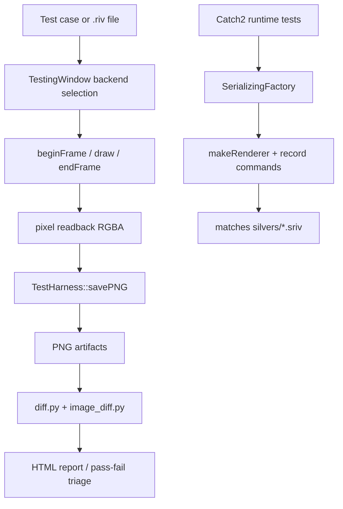

# Rive Runtime GPU Test Analysis

## Summary

`rive-runtime` uses a layered GPU test strategy:

- Catch2 unit tests for logic/runtime behavior
- "silver" tests that compare serialized draw commands
- `gms` for hand-authored visual GPU regression tests
- `goldens` for rendering real `.riv` content into PNGs and diffing against baselines

The GPU-heavy validation is centered on a backend-agnostic `TestingWindow` abstraction plus offline image diff tooling.

## Overall GPU Test Model



## 1. Backend-Normalized Rendering Surface

The core abstraction is `tests/common/testing_window.hpp`:

```cpp
class TestingWindow
{
public:
    enum class Backend { gl, d3d, d3d12, metal, vk, moltenvk, swiftshader,
                         angle, dawn, wgpu, rhi, external, coregraphics, skia, null };
    enum class Visibility { headless, window, fullscreen };

    virtual std::unique_ptr<rive::Renderer> beginFrame(const FrameOptions&) = 0;
    virtual void endFrame(std::vector<uint8_t>* pixelData = nullptr) = 0;

    virtual rive::rcp<rive_tests::OffscreenRenderTarget>
    makeOffscreenRenderTarget(uint32_t width, uint32_t height, bool riveRenderable) const;
};
```

This is the important architectural move: every backend is forced into the same contract:

- start frame
- draw
- end frame
- optionally read back pixels

That lets the exact same GM/golden logic run on GL, Vulkan, Metal, ANGLE, WGPU, etc.

## 2. Visual GPU Tests: `goldens`

`tests/goldens/goldens.cpp` renders `.riv` content into a grid, reads back pixels, then saves PNGs:

```cpp
auto renderer = TestingWindow::Get()->beginFrame({.clearColor = 0xffffffff});
...
scene->draw(renderer.get());
...
std::vector<uint8_t> pixels;
TestingWindow::Get()->endFrame(&pixels);
TestHarness::Instance().savePNG({
    .name = imageName.str(),
    .width = static_cast<uint32_t>(windowWidth),
    .height = static_cast<uint32_t>(windowHeight),
    .pixels = std::move(pixels),
});
```

It supports headless mode explicitly:

```cpp
args::Flag headless(optional,
                    "headless",
                    "perform rendering in an offscreen context",
                    {'d', "headless"});
```

This is directly relevant to ThorVG GL testing: Rive treats headless/offscreen as a first-class test mode, not an afterthought.

## 3. Visual GPU Tests: `gms`

`tests/gm/gmmain.cpp` registers many hand-written visual cases, including offscreen render target scenarios:

```cpp
MAKE_GM(offscreen_render_target)
MAKE_GM(offscreen_render_target_nonrenderable)
MAKE_GM(offscreen_render_target_preserve)
MAKE_GM(offscreen_virtual_tiles_nonrenderable)
MAKE_GM(render_canvas_basic)
MAKE_GM(render_canvas_persistence)
```

Execution is straightforward:

```cpp
TestingWindow::Get()->resize(width, height);
gm->run(name.c_str(), &pixels);
TestHarness::Instance().savePNG({
    .name = name,
    .width = width,
    .height = height,
    .pixels = std::move(pixels),
});
```

This is a very strong pattern: feature-focused GPU tests are expressed as drawing programs instead of only API assertions.

## 4. PNG Delivery and Multiprocess Coordination

`tests/common/test_harness.cpp` handles artifact saving and remote coordination:

```cpp
void TestHarness::savePNG(ImageSaveArgs args)
{
    if (!m_encodeThreads.empty()) {
        m_encodeQueue.push(std::move(args));
    } else {
        save_png_impl(std::move(args), m_outputDir, m_pngCompression, m_primaryTCPClient.get());
    }
}

bool TestHarness::claimGMTest(const std::string& name)
{
    if (m_primaryTCPClient != nullptr) {
        m_primaryTCPClient->send4(REQUEST_TYPE_CLAIM_GM_TEST);
        m_primaryTCPClient->sendString(name);
        return m_primaryTCPClient->recv4();
    }
    return true;
}
```

So Rive can shard work across processes or remote targets while avoiding duplicated test ownership.

## 5. Diff Pipeline

The visual comparison is pushed into Python:

```bash
python3 deploy_tests.py $TESTS ... --outdir=.gold/candidates/$ID --backend=$BACKEND
python3 diff.py -g .gold/$ID -c .gold/candidates/$ID -o .gold/diffs/$ID
```

`tests/diff.py` orchestrates batch diffs, while `tests/image_diff.py` computes per-image differences with OpenCV:

```python
diff = cv.absdiff(golden, candidate)
...
if self.max_diff > args.threshold:
    self.type = "failed"
else:
    self.type = "pass"
```

This separation keeps the renderer binary simple: renderers just emit PNGs; comparison/reporting happens outside.

## 6. Unit-Level "Silver" Tests

Rive also uses a non-pixel golden layer for renderer determinism. `SerializingFactory` records rendering commands:

```cpp
std::unique_ptr<Renderer> SerializingFactory::makeRenderer()
{
    return std::make_unique<SerializingRenderer>(&m_writer);
}

bool SerializingFactory::matches(const char* filename)
{
    auto fullFileName = std::string("silvers/") + filename + ".sriv";
    ...
    if (!advancedMatch(existing, m_buffer)) {
        saveTarnished(filename);
        return false;
    }
    return true;
}
```

Typical unit tests look like:

```cpp
rive::SerializingFactory silver;
auto renderer = silver.makeRenderer();
...
CHECK(silver.matches("zero_width_space_line_break"));
```

This is not a GPU pixel test, but it is still part of their renderer validation story because it catches deterministic command-stream regressions cheaply.

## 7. Backend / Headless Coverage

The local Rive docs in `.skills/opensource/rive/.Docs/43-cross-platform-testing.md` confirm the intent: `TestingWindow` is the portability layer for GL/EGL, Vulkan texture, Metal texture, WGPU, Skia raster, CoreGraphics, null backend, and more.

That means Rive's strategy is not "one GL test runner plus special cases"; it is "normalize frame lifecycle first, then reuse the same tests everywhere."

## What ThorVG Can Learn

- A tiny backend abstraction around `beginFrame/endFrame/readback` scales well.
- Offscreen render target tests deserve explicit scenarios, not only basic draw tests.
- Visual regression tooling works better when renderer binaries only emit images and external scripts do diff/report generation.
- A cheaper non-pixel golden layer like Rive's silver tests can complement GPU image tests well.

## Key Files

- `rive-runtime/tests/common/testing_window.hpp`
- `rive-runtime/tests/goldens/goldens.cpp`
- `rive-runtime/tests/goldens/goldens_arguments.hpp`
- `rive-runtime/tests/gm/gmmain.cpp`
- `rive-runtime/tests/common/test_harness.cpp`
- `rive-runtime/tests/check_golds.sh`
- `rive-runtime/tests/diff.py`
- `rive-runtime/tests/image_diff.py`
- `rive-runtime/utils/serializing_factory.cpp`
- `.skills/opensource/rive/.Docs/42-golden-visual-tests.md`
- `.skills/opensource/rive/.Docs/43-cross-platform-testing.md`
- `.skills/opensource/rive/.Docs/33-testing-and-ci-cd.md`
