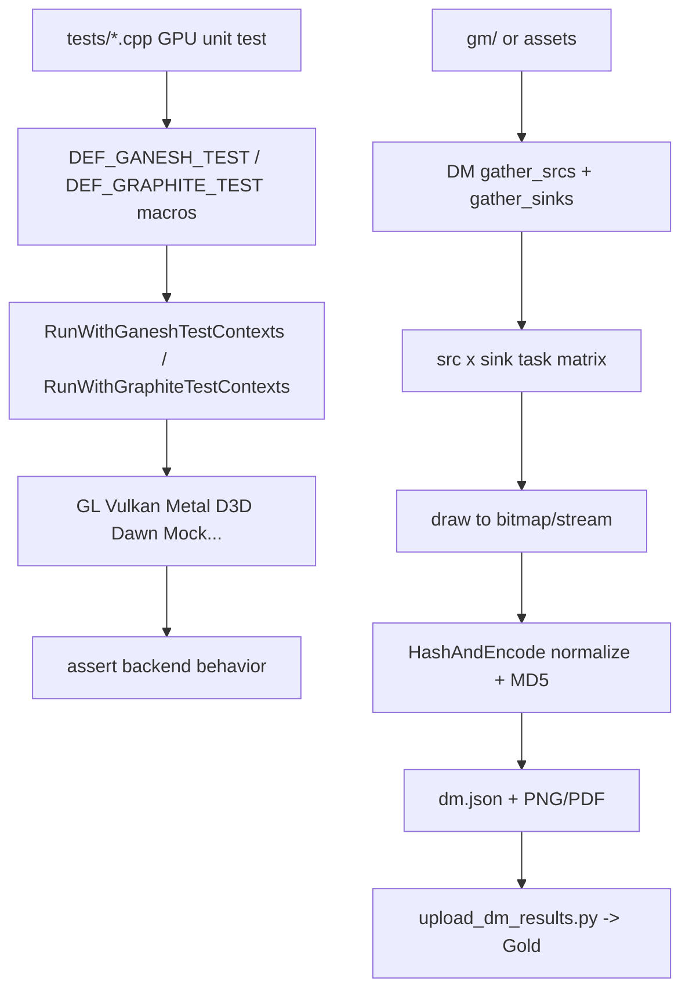

# Skia GPU Test Analysis

## Summary

`skia` tests GPU code with two distinct systems:

- macro-driven GPU unit tests in `tests/` that iterate backend contexts
- DM/GM visual regression testing that renders sources through many sinks and reports hashes to Gold

This is the most mature and large-scale version of the pattern among the surveyed projects.

## Two-Layer Model



## 1. GPU Unit Tests: Backend Matrix via Macros

The essential pattern lives in `tests/Test.h`:

```cpp
#define DEF_GANESH_TEST_FOR_RENDERING_CONTEXTS(name, reporter, context_info, ctsEnforcement) \
    DEF_GANESH_TEST_FOR_CONTEXTS(                                                            \
            name, skgpu::IsRenderingContext, reporter, context_info, nullptr, ctsEnforcement)

#define DEF_GANESH_TEST_FOR_GL_CONTEXT(name, reporter, context_info, ctsEnforcement) \
    DEF_GANESH_TEST_FOR_CONTEXTS(name, &skiatest::IsGLContextType, reporter, context_info, \
                                 nullptr, ctsEnforcement)
```

So test authors write one test body, and the framework runs it against the appropriate live backends.

Example usage in the real tree:

```cpp
DEF_GANESH_TEST_FOR_GL_CONTEXT(EGLImageTest, reporter, ctxInfo, CtsEnforcement::kApiLevel_T) {
    ...
}

DEF_GANESH_TEST_FOR_RENDERING_CONTEXTS(ClearOp, reporter, ctxInfo, CtsEnforcement::kApiLevel_T) {
    ...
}
```

This is exactly the kind of backend-matrix execution ThorVG does not yet have.

## 2. Iteration Engine

`dm/DMGpuTestProcs.cpp` is the runtime that actually loops contexts:

```cpp
for (int typeInt = 0; typeInt < skgpu::kContextTypeCount; ++typeInt) {
    skgpu::ContextType contextType = static_cast<skgpu::ContextType>(typeInt);
    ...
    GrContextFactory factory(options);
    ContextInfo ctxInfo = factory.getContextInfo(contextType);
    if (filter && !(*filter)(contextType)) {
        continue;
    }
    if (ctxInfo.directContext()) {
        (*testFn)(reporter, ctxInfo);
        ctxInfo.testContext()->makeCurrent();
        ctxInfo.directContext()->flushAndSubmit(GrSyncCpu::kYes);
    }
}
```

This matters because Skia is not just checking compile-time backend support. It:

- creates each backend context
- skips unavailable ones naturally
- runs the test with per-backend reporting scope
- flushes and restores current context after the test

That is a very useful precedent for ThorVG GL engine tests.

## 3. DM/GM Visual Regression Harness

DM (`dm/DM.cpp`, `dm/DMSrcSink.cpp`) is the visual regression layer. It builds a cross-product of sources and sinks:

- sources: GM, SKP, SVG, image, lottie, rive, etc.
- sinks: raster, Ganesh GPU, Graphite GPU, PDF, SVG, and wrappers

The task run flow in `DM.cpp`:

```cpp
Result result = task.sink->draw(*task.src, &bitmap, &stream, &log);
...
if (data->getLength()) {
    hash.writeStream(data, data->getLength());
} else {
    hashAndEncode = std::make_unique<HashAndEncode>(bitmap);
    hashAndEncode->feedHash(&hash);
}
...
if (!gGold->contains(Gold(task.sink.tag, task.src.tag, task.src.options, name, md5))) {
    fail(...);
}
```

So DM is not doing fuzzy local image diff like Rive. It normalizes output, hashes it, and compares against approved Gold expectations.

## 4. GMs Become Sources

`DMSrcSink.cpp` wraps GMs as reusable sources:

```cpp
Result GMSrc::draw(SkCanvas* canvas, GraphiteTestContext* testContext) const {
    std::unique_ptr<skiagm::GM> gm(fFactory());
    skiagm::DrawResult gpuSetupResult = gm->gpuSetup(canvas, &msg, testContext);
    ...
    skiagm::DrawResult drawResult = gm->draw(canvas, &msg);
    ...
}
```

This is another important idea: backend-specific setup belongs inside the test source when needed, while the runner stays generic.

## 5. Output Normalization Before Hashing

`tools/HashAndEncode.h` explains the key trick:

```cpp
// HashAndEncode transforms any SkBitmap into a standard format, currently
// 16-bit unpremul RGBA in the Rec. 2020 color space.
```

That is why Skia can compare outputs across different backends/configurations more reliably. They do not hash raw backend-native pixels blindly.

For ThorVG, this suggests that if backend-to-backend pixel comparisons become noisy, a normalization layer may be needed before declaring mismatches.

## 6. Gold Integration

Skia's infra uploads both images and `dm.json` summaries:

```python
image_dest_path = 'gs://%s/dm-images-v1' % api.properties['gs_bucket']
...
api.gsutil.cp('dm.json', json_file, summary_dest_path + '/' + DM_JSON, extra_args=['-Z'])
```

And task generation passes builder metadata into DM so Gold keys are rich and stable:

```go
args := []string{
    "dm",
    "--nameByHash",
}
...
args = append(args, "--key")
args = append(args, keys...)
```

This is infrastructure-heavy, but the design principle is valuable: keep test execution and result triage separable.

## 7. Why Skia's Model Matters

Skia has both:

- API/backend unit tests for resource lifecycle, readback, surface semantics, shader behavior
- visual regression tests for end-to-end rendering correctness

That split is healthy. It means not every GPU issue is forced into pixel goldens, and not every visual issue is forced into unit assertions.

## What ThorVG Can Learn

- Introduce backend-tagged GPU unit tests first, similar to `DEF_GANESH_TEST_FOR_GL_CONTEXT`.
- Skip unavailable contexts at runtime instead of failing the whole suite.
- Keep visual regression distinct from API-level unit tests.
- If cross-backend comparisons become important later, normalize before hashing/comparing.

## Key Files

- `skia/tests/Test.h`
- `skia/dm/DMGpuTestProcs.cpp`
- `skia/dm/DM.cpp`
- `skia/dm/DMSrcSink.cpp`
- `skia/tools/HashAndEncode.h`
- `skia/infra/bots/recipes/upload_dm_results.py`
- `skia/infra/bots/gen_tasks_logic/dm_flags.go`
- `.skills/opensource/skia/N_Testing/346-dm-test-harness-architecture.md`
- `.skills/opensource/skia/N_Testing/348-gpu-specific-test-infrastructure.md`
- `.skills/opensource/skia/N_Testing/349-gm-golden-master-test-system.md`
